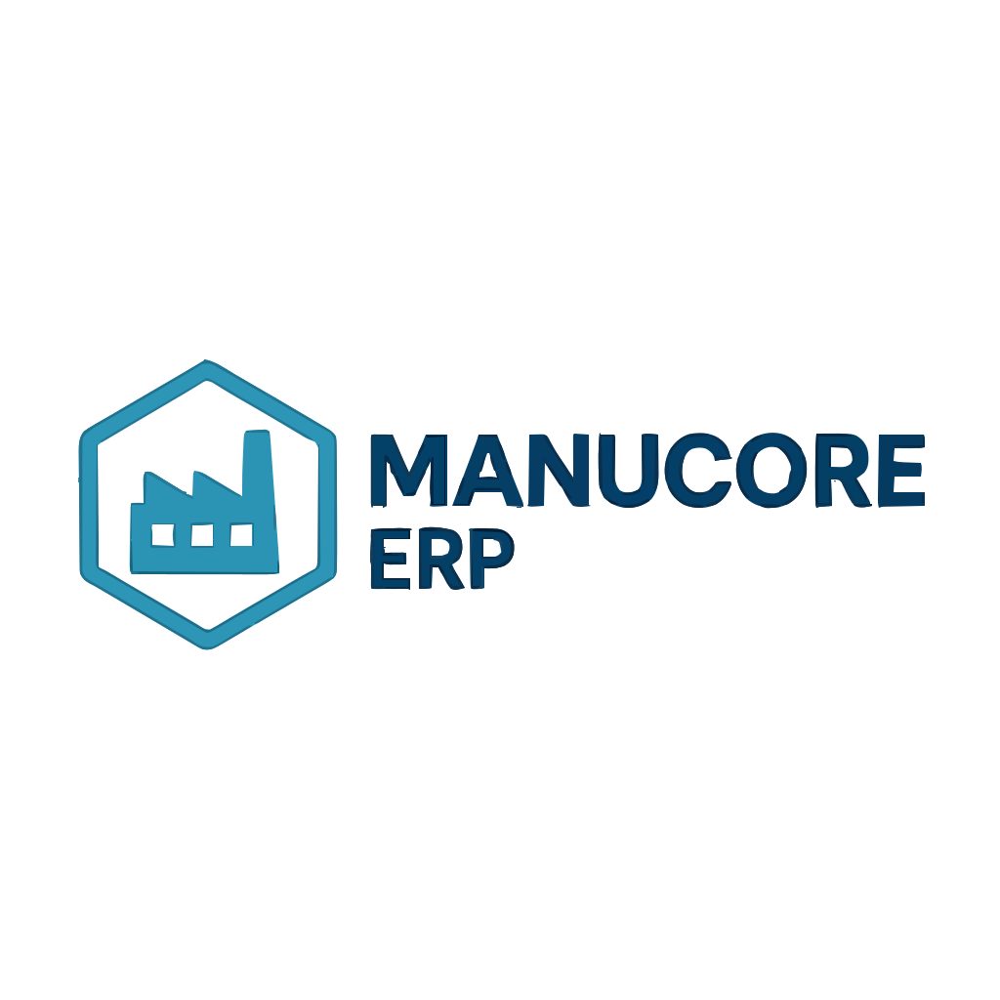

<p align="center">
  <a href="https://rockruff.ibez.co.za" target="_blank">
    <!-- Replace this path with your own logo file once added (see "🔧 Logo Placement"). -->
    
  </a>
</p>

<p align="center">
  <a href="https://github.com/<ORG>/<REPO>/actions">
    /<REPO>/workflows/ci/badge.svg" alt="CI Status">
  </a>
  
  
  
  
</p>

<h1 align="center">ManuCore ERP</h1>

> Modern manufacturing ERP built on Laravel 12. Multi-surface architecture (Front/App/System), strict phase-based delivery, and a professional theme system.  
> **Developed by iBez Solutions.**  
> **Live:** https://rockruff.ibez.co.za

---

## 📚 Project Index

-   **Project tracker (source of truth):** [`/docs/Project_Tracker.md`](docs/Project_Tracker.md)
-   **Developer & Ops Manual:** [`/docs/Manual.md`](docs/Manual.md)
-   **Live App:** https://rockruff.ibez.co.za

> **Assistant Protocol:** Any AI assistant (including ChatGPT/Claude) must read **`/docs/Project_Tracker.md`** first and follow the DoD gating there. The Manual is secondary for day-to-day how-to.

---

## ✨ Overview

ManuCore ERP is a Laravel 12–based ERP tailored for manufacturing. It ships with:

-   **Multi-surface UI** (Front, App, System) with separate routes, layouts, and brand bundles.
-   **Theme system** (Tailwind **v4**) with 5 professional themes and ERP utility classes.
-   **Phase roadmap** (0 → 1 → 4 → 2 → 3 → 5) with Definition of Done (DoD) gates.
-   **Ops posture**: Nginx + PHP-FPM, Redis queues, Supervisor, UFW/Fail2Ban, Let’s Encrypt.

---

## 🏛 Architecture at a Glance

Front (Public) -> routes/front.php → App\Http\Controllers\Front* → resources/views/front/* → public/brand/front/_
App (ERP - Auth) -> routes/app.php → App\Http\Controllers\App_ → resources/views/app/_ → public/brand/app/_
System (Settings/Admin) -> routes/settings.php, routes/admin.php
App\Http\Controllers{Settings,Admin}_
resources/views/{settings,admin}/_
public/brand/system/\*

markdown
Copy code

**CSS bundles**

-   `resources/css/theme.css` (shared ERP utilities + CSS variables)
-   `resources/css/front.css` (Front)
-   `resources/css/app.css` (App)
-   `resources/css/panel.css` (System)

**Canonical routes**  
`home, about, contact, dashboard, dashboard.analytics, settings.index, settings.company, settings.branches, admin.index, admin.users, admin.roles`

---

## 🚦 Status & Phase Flow

-   **Current Phase:** see `/docs/Project_Tracker.md`
-   **Flow:** `0 → 1 → 4 → 2 → 3 → 5`
-   Advance only when **all DoD** items pass for the current phase.

---

## 🔧 Logo Placement (App & README)

### In-app branding (used by the three surfaces)

Place your logos/favicons here (already referenced by the layouts):

public/brand/front/logo.svg public/brand/front/favicon.svg
public/brand/app/logo.svg public/brand/app/favicon.svg
public/brand/system/logo.svg public/brand/system/favicon.svg

scss
Copy code

### README header logo (GitHub rendering)

Store a repo-visible copy (recommended):

docs/assets/manucore-logo.svg

php-template
Copy code

Then the README header can reference it with a **relative path** (works in GitHub):

```html
<p align="center">
    <a href="https://rockruff.ibez.co.za" target="_blank">
        
    </a>
</p>
Alternative: host it via the repo’s raw URL
https://raw.githubusercontent.com/<ORG
    >/<REPO
        >/main/docs/assets/manucore-logo.svg Replace
        <ORG
            >/<REPO>
                with your GitHub org/repo. 🛠 Quick Start (Local) Prereqs: PHP
                8.3, Composer, Node 20, MySQL 8, Redis, Git bash Copy code git
                clone https://github.com/<ORG
                    >/<REPO
                        >.git manucore-erp cd manucore-erp cp .env.example .env
                        # Fill DB/Redis/Mail vars composer install php artisan
                        key:generate npm install npm run build # or: npm run dev
                        php artisan migrate # when DB is configured php artisan
                        serve # http://127.0.0.1:8000 Tailwind v4 is already
                        wired (PostCSS plugin). Do not run tailwindcss init -p.
                        🎨 Theme System (Tailwind v4) Central variables +
                        utilities live in resources/css/theme.css. 5 themes via
                        data-theme attribute: blue | teal | purple | coral |
                        slate. Each surface imports theme.css and adds its own
                        look: front.css, app.css, panel.css. Build: bash Copy
                        code npm run build # production # or npm run dev # watch
                        📦 Environment Laravel: 12.26.2 PHP: 8.3 (FPM + OPCache)
                        DB: MySQL 8.0 Cache/Queue: Redis Node: 20 LTS Server OS
                        (prod): Ubuntu 24.04 LTS Fill .env (mask secrets in
                        commits). See examples in /docs/Manual.md. 🚀 Deploy
                        (Manual Runbook) bash Copy code git pull composer
                        install --no-dev --optimize-autoloader npm ci && npm run
                        build php artisan migrate --force php artisan
                        optimize:clear php artisan config:cache && php artisan
                        route:cache && php artisan view:cache sudo systemctl
                        restart php8.3-fpm nginx Queues via Supervisor and
                        nightly backups are covered in /docs/Manual.md. 🧪 QA &
                        Testing Prefer Pest (or PHPUnit) for feature tests.
                        Smoke test the surfaces: / (Front) /dashboard (App)
                        /system/settings & /system/admin (System) See checklists
                        in /docs/Manual.md and DoD in /docs/Project_Tracker.md.
                        🤝 Contributing Use small PRs, link to phase tasks.
                        Conventional commits: feat:, fix:, docs:, refactor:,
                        test:, build:, ci:, chore:. Keep
                        /docs/Project_Tracker.md and /docs/Manual.md in sync
                        with changes. 🔐 Security If you discover a security
                        issue, please contact the maintainers privately (e.g.,
                        security@ibez.co.za or your internal channel). We will
                        address it promptly. 📄 License This project is
                        open-sourced software licensed under the MIT license.
                        Built with ❤️ on Laravel. ManuCore ERP is developed by
                        iBez Solutions. 🙏 Acknowledgements Laravel framework
                        and community. Tailwind CSS & plugin authors.
                        Open-source dependencies listed in composer.json and
                        package.json.</REPO
                    ></ORG
                ></REPO
            ></ORG
        ></REPO
    ></ORG
>
```
